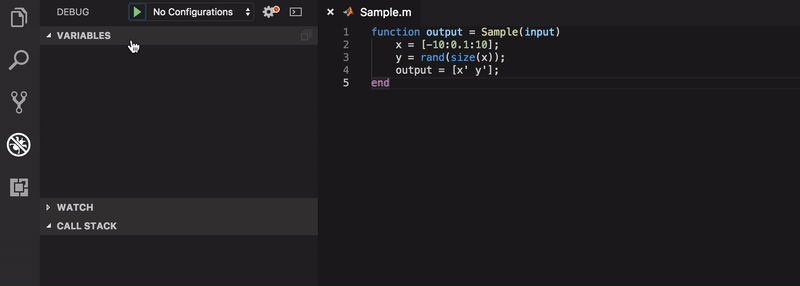

# VS Code Octave Debugger

This extension provides debugging support for Octave code. This is done by interfacing with `octave-cli` via stdin/stdout. Support for running Matlab code is done through `octave-cli`.
Do read the changelog to know what's new in this version.
Though this is not necessary to use the extension, I still recommend the following language extension for Octave syntax highlighting, snippets, and most cool code outline [Octave Hacking](https://marketplace.visualstudio.com/items?itemName=apjanke.octave-hacking). If you want Matlab language support you can use [Matlab](https://marketplace.visualstudio.com/items?itemName=Gimly81.matlab), though you don't get the outline. The only thing we're missing is F12 "jump to definition" code navigation.

**Octave Debugger**
This extension supports actions:
 * continue, step, step in, step out,
 * breakpoints, conditional breakpoints,
 * variable inspection, variable editing
 * stack navigation and visualization
 * expression evaluation, via console input, watch UI, or mouse hover

The following types are currently supported:
 * Scalar: [floats](https://octave.org/doc/v5.1.0/Single-Precision-Data-Types.html) and [ints](https://octave.org/doc/v5.1.0/Integer-Data-Types.html), the default type being double
 * [Matrix](https://octave.org/doc/v5.1.0/Matrices.html) of all basic types, includes ComplexMatrix/BoolMatrix
 * [DiagonalMatrix/ComplexDiagonalMatrix/PermutationMatrix](https://octave.org/doc/v5.1.0/Diagonal-and-Permutation-Matrices.html)
 * [SparseMatrix/SparseComplexMatrix](https://octave.org/doc/v5.1.0/Sparse-Matrices.html)
 * [Range](https://octave.org/doc/v5.1.0/Ranges.html)
 * [ScalarStruct/Struct](https://octave.org/doc/v5.1.0/Structures.html)
 * [Inline functions](https://octave.org/doc/v5.1.0/Inline-Functions.html) and [function handles](https://octave.org/doc/v5.1.0/Function-Handles.html)
 * [Cell Arrays](https://octave.org/doc/v5.1.0/Cell-Arrays.html)
 * LazyIndex (No docs. This might be an internal type only.)
 * [SqString](https://octave.org/doc/v5.1.0/Escape-Sequences-in-String-Constants.html#Escape-Sequences-in-String-Constants)
 * [Strings](https://octave.org/doc/v5.1.0/Strings.html)
 * UnknownType: represents unknown types as strings.

If a type isn't supported request it on the [project repository](https://github.com/paulo-fernando-silva/vscOctaveDebugger.git).

If you want to edit the value of a variable be it scalar, array, or structure, you can double click on it in the `VARIABLES` view, and type in the new value.
That expression will be evaluated and if successful the variable will be updated with the new value.
You can also submit any command you like through the debug console as if it you were typing directly into Octave.

More information about debugging with Octave can be found
[here](https://octave.org/doc/v5.1.0/Debugging.html).

## Using Octave Debugger

* Open a directory containing the project that you want to debug.
* In the debug view click the `DEBUG` drop-down box and select `"Add configuration..."`
* Select `"OctaveDebugger"` from the menu that pops up.
* The following is an example of a minimal configuration:

>
    "type": "OctaveDebugger",
    "request": "launch",
    "name": "My Hello World",
    "program": "printf('Hello World');"

* Set breakpoints as needed.
* Press the `DEBUG` '▷' button or F5 to start debugging.
* Open the `DEBUG CONSOLE` to view any output from your program or to interact with it. Commands will be sent directly to Octave.
Note that `octave-cli` must be installed on your system. You can download it [here](https://www.gnu.org/software/octave/download.html).

## Understanding the Debug Session Configuration

* Example configuration:

>
    "type": "OctaveDebugger",
    "request": "launch",
    "name": "My Debug Config - free text",
    "program": "file_or_function_name_and_parameters(foo,bar)",
    "octave": "/path/to/octave-cli",
    "sourceFolder": "${workspaceFolder}:/usr/local/matlab/code:/opt/local/matlab/more_code",
    "workingDirectory": "${workspaceFolder}",
    "autoTerminate": true

* `"octave"` must point to the location where `"octave-cli"` is installed. This parameter is optional, and defaults to `"octave-cli"` which assumes that `"octave-cli"` is in your path. If that's not the case make sure to provide the full installation path.
* `"sourceFolder"` is an optional parameter that defaults to `"${workspaceFolder}"`. Basically it is added using `"addpath()"` before starting the `"program"`. More than one directory can be added by separating them with `pathsep()` which defaults to `:`.

For example:

>
        "program": "foo",
        "sourceFolder": "${workspaceFolder}/A/B/C/"

is equivalent to

>
        "program": "${workspaceFolder}/A/B/C/foo.m"

* `"workingDirectory"` is another optional parameter. Octave will switch to this directory before running `"program"`. In the following example  program `"foo"` can exist anywhere under `"${workspaceFolder}"`, but will be executed from `"${workspaceFolder}/A/B/C/"`:

>
    "program": "foo",
    "sourceFolder": "${workspaceFolder}"
    "workingDirectory": "${workspaceFolder}/A/B/C/"

* `"program"` can be anything that can be evaluated, e.g. `"path/to/file.m"`, or `"functionName(value)"`.
* `"autoTerminate"` Setting this to false will allow the program to continue executing after the last line of code is executed. This is useful if you're running for example UI elements with callbacks and you want to continue debugging after the end of the program code. You'll need to stop the debug session manually by pressing the □ button.
* `"splitFieldnamesOctaveStyle"` this allows struct field names to be almost arbitrary ([details](https://octave.org/doc/v5.1.0/Creating-Structures.html)). This option is not compatible with Matlab and so it's off by default ([details](https://www.mathworks.com/help/matlab/matlab_prog/generate-field-names-from-variables.html)).

## Project Homepage
Source available [here](https://github.com/paulo-fernando-silva/vscOctaveDebugger.git).
Please submit bugs there too.

## Known Issues

The following issues will likely not be fixed. For other open issues see [here](https://github.com/paulo-fernando-silva/vscOctaveDebugger/issues).

* ans: Is not displayed in the variables view by default. You can still output it in the console or watch view.
* stdinput: Currently if you're stepping you can't rely on stdinput from your Matlab/Octave code. For example, you can use functions like `pause()`, `input()`, `keyboard()`, etc, as long as it's not during a step over, step into, or step out. To work around this you can press F5 (continue), and `pause()` will wait for your input in the `DEBUG CONSOLE`. The issue comes from the communication that the plugin does with Octave in order to control execution. When using the console or continuing the execution no such communication exists. So you can step over/into/out using the `DEBUG CONSOLE`, by typing `dbstep` and pressing the `RETURN` key (see [here](https://octave.org/doc/v5.1.0/Debug-Mode.html) for details). Then each new `RETURN` should work as a step directly. This is the way `octave-cli` works by default. Since the `DEBUG CONSOLE` just forwards your commands to `octave-cli` you can interact with it as if it was a normal terminal.
* Octave will accept arbitrary strings as struct field names. When Octave field names are enabled using `"splitFieldnamesOctaveStyle": true` in the launch options, the only strings that can't be used are strings of the type `/\n?  \[\d+,1\] = /`. Enabling this is not recommended.

## History :)

I started this project back in December 2017 or January 2018, not quite sure anymore, when I was going through the exercises from the [Andrew Ng's machine learning class](http://openclassroom.stanford.edu/MainFolder/CoursePage.php?course=MachineLearning).
Also check these playlists [Stanford Machine Learning](https://www.youtube.com/watch?v=UzxYlbK2c7E&list=PLA89DCFA6ADACE599), [Caltech Learning from Data](https://www.youtube.com/watch?v=VeKeFIepJBU&list=PLCA2C1469EA777F9A), [Deep Learning tutorial](http://ufldl.stanford.edu/tutorial/), and there's plenty more from MIT and others.

Since I was really into vscode but unfortunately there was no Octave debugger at the time, and since I have a long commute to work, I decided to use that time to develop this adapter.
It kind of was an on and off development, but I would say that about 80% of it was done on the train while commuting to work. I really would like to thank Andrew and all the openclassroom and other similar projects (e.g. OpenCourseWare), and of course the people behind Octave and vscode.

## High-Level Description of Inner Workings

A debug session follows these steps
 * Debug session begin or step
 * Request stack frames comes in
 * Request scopes for selected frame comes in (usually 0, the top frame, but can go up to n where n is the current stack frames depth).
 * Request variables for current open scopes comes in (scope reference is only fetched if > 0) If scope is different than 0, then we need to do a `dbup` or `dbdown` before fetching the variables.
 * Request child variables as needed (child variable ref > 0)

More information about vscode Debug Adapter Protocol can be found here [DAP](https://microsoft.github.io/debug-adapter-protocol/overview) and the [API](https://code.visualstudio.com/docs/extensionAPI/api-debugging), and information on publishing extensions can be found [here](https://code.visualstudio.com/docs/extensions/publish-extension#_publishers-and-personal-access-tokens).
Funny fact, I noticed too late that the name of the plugin is not only spelled wrong but also it doesn't follow the expected "no caps and words separated by hyphens" pattern. :p